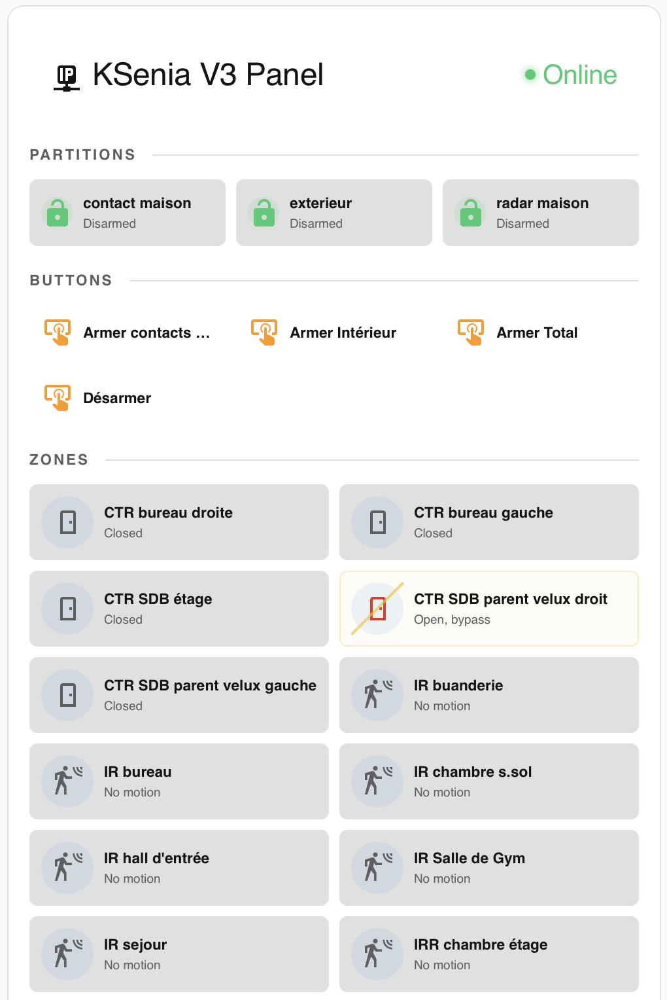

# Ksenia Lares

[![GitHub Release][releases-shield]][releases]
[![GitHub Activity][commits-shield]][commits]
[![License][license-shield]](LICENSE)

[![hacs][hacsbadge]][hacs]
![Project Maintenance][maintenance-shield]

[![BuyMeCoffee][buymecoffeebadge]][buymecoffee]

<!--
Uncomment and customize these badges if you want to use them:

[![BuyMeCoffee][buymecoffeebadge]][buymecoffee]
[![Discord][discord-shield]][discord]
-->

**✨ Develop in the cloud:** Want to contribute or customize this integration? Open it directly in GitHub Codespaces - no local setup required !

[](https://codespaces.new/amg0/ha_ksenia?quickstart=1)

## ✨ Features

Home Assistant custom integration for KSenia Lares 3.0 16IP, 48IP or 128IP models

- **Easy Setup**: Simple configuration through the UI - no YAML required
- **Zone Monitoring**: Monitor alarm zone status and choose from Motion, Door, Window, or Smoke sensor types
- **Connectivity Tracking**: Real-time tracking of API connection status
- **Reconfigurable**: Change credentials anytime without removing the integration
- **Options Flow**: Adjust settings like update interval after setup
- **Service Actions**: Force data refresh via service calls, Trigger the execution of a KSenia Alarm Scenario

**This integration will set up the following platforms.**

| Platform        | Description                                                                          |
| --------------- | ------------------------------------------------------------------------------------ |
| `binary_sensor` | API connectivity, partition armed status, zone sensors (motion, door, window, smoke) |
| `button`        | Scenario execution buttons for each configured alarm scenario                        |
| `sensor`        | System event logs tracking all KSenia alarm events                                   |

## 🚀 Quick Start

### Step 1: Install the Integration

**Prerequisites:** This integration requires [HACS](https://hacs.xyz/) (Home Assistant Community Store) to be installed.

Click the button below to open the integration directly in HACS:

[](https://my.home-assistant.io/redirect/hacs_repository/?owner=jpawlowski&repository=ha_ksenia&category=integration)

Then:

1. Click "Download" to install the integration
2. **Restart Home Assistant** (required after installation)

> [!NOTE]
> The My Home Assistant redirect will first take you to a landing page. Click the button there to open your Home Assistant instance.

<details>
<summary><strong>Manual Installation (Advanced)</strong></summary>

If you prefer not to use HACS:

1. Download the `custom_components/ksenia/` folder from this repository
2. Copy it to your Home Assistant's `custom_components/` directory
3. Restart Home Assistant

</details>

### Step 2: Add and Configure the Integration

**Important:** You must have installed the integration first (see Step 1) and restarted Home Assistant!

#### Option 1: One-Click Setup (Quick)

Click the button below to open the configuration dialog:

[](https://my.home-assistant.io/redirect/config_flow_start/?domain=ksenia)

Follow the setup wizard:

1. Enter the KSenia ip address or host name
2. Enter the port number
3. Enter your username
4. Enter your password
5. Click Submit

That's it! The integration will start loading your data.

#### Option 2: Manual Configuration

1. Go to **Settings** → **Devices & Services**
2. Click **"+ Add Integration"**
3. Search for "Ksenia Lares"
4. Follow the same setup steps as Option 1

### Step 3: Adjust Settings

After setup, you can adjust options:

1. Go to **Settings** → **Devices & Services**
2. Find **Ksenia Lares**
3. Click **Configure** to adjust:
   - Host / Ip address
   - Port number
   - user name
   - password

At this point the connectivity will be checked to ensure proper IP & credentials are entered. You can also **Reconfigure** your credentials anytime without removing the integration.

In a second dialog, you will be asked to enter:

1. Update interval (how often to refresh data in seconds)
2. A PIN number used to execute alarm scenarios

In a third dialog, you will be presented with all the alarm zones detected and you will be asked to specify the type for each zone:

1. Motion detector
2. Door contact sensor
3. Window contact sensor
4. Smoke detector

### Step 4: Start Using!

The integration creates entities for each KSenia component detected on your alarm panel:

- **Binary Sensors**: API connection status, partition status (per partition), zone sensors (motion, door, window, smoke)
- **Buttons**: One button per configured alarm scenario
- **Sensors**: System event logs with last 60 KSenia alarm events stored in attributes

Find all entities in **Settings** → **Devices & Services** → **Ksenia Lares** → click on the device.

## Configuration Options

### During Setup

| Name     | Required | Description                             |
| -------- | -------- | --------------------------------------- |
| Host     | Yes      | Your KSenia IP address or hostname      |
| Port     | Yes      | Your KSenia Web application port number |
| Username | Yes      | Your account username                   |
| Password | Yes      | Your account password                   |

### Second Phase

You can change these anytime by clicking **Configure**:

| Name            | Default | Description               |
| --------------- | ------- | ------------------------- |
| Update Interval | 15 sec  | How often to refresh data |

### Third Phase

You can change these anytime by clicking **Configure**:

| Name                 | Default | Description                                                              |
| -------------------- | ------- | ------------------------------------------------------------------------ |
| Zone Type (per zone) | MOTION  | Choose from MOTION, DOOR, WINDOW, or SMOKE sensor for each detected zone |

## Available Entities

### Binary Sensors

#### API Connection

Shows whether the connection to the KSenia panel is active.

| State | Meaning                                  |
| ----- | ---------------------------------------- |
| `on`  | Connected and receiving data             |
| `off` | Connection lost or authentication failed |

**Attributes:**

| Attribute         | Type  | Description                         |
| ----------------- | ----- | ----------------------------------- |
| `update_interval` | `str` | Current update interval in seconds  |
| `integration`     | `str` | Integration domain (`ksenia`)       |
| `host`            | `str` | KSenia panel IP address or hostname |
| `name`            | `str` | KSenia panel name                   |
| `model`           | `str` | KSenia panel model                  |
| `info`            | `str` | Additional panel information        |
| `version`         | `str` | Firmware version                    |
| `revision`        | `str` | Firmware revision                   |
| `build`           | `str` | Firmware build number               |

#### Partition Status

Reports the status of each alarm partition on your KSenia panel. One entity is created per partition.

| State | Meaning                          |
| ----- | -------------------------------- |
| `on`  | Partition is DISARMED (unlocked) |
| `off` | Partition is armed               |

**Attributes:**

| Attribute          | Type  | Description                                                                                          |
| ------------------ | ----- | ---------------------------------------------------------------------------------------------------- |
| `partition_status` | `str` | Current partition status (e.g., `DISARMED`, `EXIT`, `ARMED_IMMEDIATE`, `ARMED`, `PREALARM`, `ALARM`) |

#### Zone Sensors

Reports the status of each alarm zone. Zones are dynamically detected from your KSenia hardware and can be configured as **Motion**, **Door**, **Window**, or **Smoke** type during setup (third config flow phase).

**Motion sensor:**

| State | Meaning                                     |
| ----- | ------------------------------------------- |
| `on`  | Motion detected (zone status is not NORMAL) |
| `off` | No motion (zone status is NORMAL)           |

**Door/Window sensor:**

| State | Meaning                             |
| ----- | ----------------------------------- |
| `on`  | Contact opened (door/window open)   |
| `off` | Contact closed (door/window closed) |

**Smoke sensor:**

| State | Meaning                          |
| ----- | -------------------------------- |
| `on`  | Smoke detected                   |
| `off` | No smoke (zone status is NORMAL) |

Zone entities are created dynamically based on your KSenia hardware. Each zone's device class is determined by the selection you made during setup.

### Buttons

#### Scenario Button

One button is created for each alarm scenario configured on your KSenia panel. Pressing the button or calling the standard button_press action executes the corresponding scenario.

**Requires:** A PIN code must be entered in the integration options for scenarios to execute successfully.

### Generic Sensor for Logs

Reports the events ( 60 last ) from the Ksenia alarm

#### Dashboard Example: Alarm Events Table

You can display your Ksenia alarm events as a formatted table in your Home Assistant dashboard using a Markdown card with Jinja2 templating:

```yaml
type: markdown
title: 🔔 Ksenia Alarm Events
content: >
  | Time | Event | Triggered By | Via |

  | :--- | :--- | :--- | :--- |

  | {{ as_timestamp(item.timestamp) |
  timestamp_custom('%d/%m %H:%M') }} | **{{ item.event }}** | {{
  item.generator }} | *{{ item.means }}* |

  
grid_options:
  columns: full
```

> [!NOTE]
> Replace `sensor.ksenia_lares_ksenia_logs` with the actual entity ID of your Ksenia logs sensor if it differs. The table displays the last 60 events from your alarm panel.

## Custom Services

The integration provides services for advanced automation:

### `ksenia.reload_data`

Manually refresh data from the API without waiting for the configured update interval.

**Example:**

```yaml
service: ksenia.reload_data
```

Use this service in automations or scripts when you need immediate data refresh (e.g., after arming/disarming the alarm manually).

### `ksenia.run_scenario`

Execute a KSenia alarm scenario by name on a target entity. This requires a PIN code to be configured in the integration options.

**Fields:**

| Field           | Required | Type  | Description                         | Example      |
| --------------- | -------- | ----- | ----------------------------------- | ------------ |
| `scenario_name` | Yes      | `str` | The name of the scenario to execute | `"Arm Away"` |

**Example:**

```yaml
service: ksenia.run_scenario
data:
  target:
    entity:
      - sensor.kitchen_motion
  scenario_name: "Arm Away"
```

> [!NOTE]
> The PIN code must be set in the integration options (Settings → Devices & Services → Ksenia Lares → Configure) for scenarios to execute successfully

### `ksenia.zone_bypass`

Toggle the bypass (exclusion) state of a KSenia alarm zone. If the zone is currently active, it will be bypassed; if already bypassed, it will be un-bypassed.

**Fields:**

| Field       | Required | Type  | Description                                    | Example                 |
| ----------- | -------- | ----- | ---------------------------------------------- | ----------------------- |
| `entity_id` | Yes      | `str` | The binary sensor entity representing the zone | `"sensor.kitchen_door"` |

**Example:**

```yaml
service: ksenia.zone_bypass
data:
  entity_id: sensor.kitchen_door
```

> [!NOTE]
> The PIN code must be set in the integration options (Settings → Devices & Services → Ksenia Lares → Configure) for bypass operations to execute successfully. The zone binary sensor must have an `index` attribute (all zone entities provide this).

## Supported Devices

This integration supports Ksenia Lares alarm panels. The following components are auto-detected from your hardware:

- **Partitions**: Each alarm partition on the panel becomes a binary sensor
- **Zones**: Each physical zone (motion detector, door/window contact, etc.) becomes a binary sensor
- **Scenarios**: Each configured alarm scenario becomes an executable button entity

## Lovelace Custom Card

This integration includes a built-in Lovelace card called `custom:ksenia-card`.
The card shows different area with:

- the status of each partition
- the available alarm scenario as button which can be pressed
- the status of each zone with a cross over if the zone is in ByPass mode



### Installation

There is nothing special to install for the card. It is included automatically with the integration, so once `Ksenia Lares` is installed and Home Assistant is restarted, the card becomes available in Lovelace.

### Adding the Card to a Dashboard

1. Open your Home Assistant dashboard.
2. Click the three-dot menu in the top-right corner and choose **Edit Dashboard**.
3. Click **Add Card**.
4. Choose **Manual**.
5. Paste the following YAML, or choose the card type if it appears in the card picker
6. Save the card.

```yaml
type: custom:ksenia-card
title: KSenia V3 Panel
zone_columns: 4
```

### Card Configuration Parameters

| Parameter           | Type   | Default           | Description                                                               |
| ------------------- | ------ | ----------------- | ------------------------------------------------------------------------- |
| `title`             | string | `KSenia V3 Panel` | Optional title text displayed in the card header.                         |
| `zone_columns`      | number | `4`               | Number of columns used to display the zone sensors. Valid values are 1–8. |
| `partition_columns` | number | `4`               | Number of columns used to display the partitions. Valid values are 1–8.   |

> [!TIP]
> On small screen ( like phone ) the columns parameter may be ignored and forced to a small screen layout format automatically

### Example Configuration

A simple card configuration with a custom title and 3 columns for zone sensors:

```yaml
type: custom:ksenia-card
title: My Alarm Zones
zone_columns: 3
partition_columns: 2
```

If you do not specify `zone_columns`, the card defaults to `4`.

## Troubleshooting

### Authentication Issues

#### Reauthentication

If your credentials expire or change, Home Assistant will automatically prompt you to reauthenticate:

1. Go to **Settings** → **Devices & Services**
2. Look for **"Action Required"** or **"Configuration Required"** message on the integration
3. Click **"Reconfigure"** or follow the prompt
4. Enter your updated credentials
5. Click Submit

The integration will automatically resume normal operation with the new credentials.

#### Manual Credential Update

You can also update credentials at any time without waiting for an error:

1. Go to **Settings** → **Devices & Services**
2. Find **Ksenia Lares**
3. Click the **3 dots menu** → **Reconfigure**
4. Enter new username/password
5. Click Submit

#### Connection Status

Monitor your connection status with the **API Connection** binary sensor:

- **On** (Connected): Integration is receiving data normally
- **Off** (Disconnected): Connection lost or authentication failed
  - Check the binary sensor attributes for diagnostic information
  - Verify credentials if authentication failed
  - Check network connectivity

### Enable Debug Logging

To enable debug logging for this integration, add the following to your `configuration.yaml`:

```yaml
logger:
  default: info
  logs:
    custom_components.ksenia: debug
```

### Common Issues

#### Authentication Errors

If you receive authentication errors:

1. Verify your username and password are correct
2. Check that your account has the necessary permissions
3. Wait for the automatic reauthentication prompt, or manually reconfigure
4. Check the API Connection binary sensor for status

#### Device Not Responding

If your device is not responding:

1. Check the **API Connection** binary sensor - it should be "On"
2. Check your network connection
3. Verify the device is powered on
4. Check the integration diagnostics (Settings → Devices & Services → Ksenia Lares → 3 dots → Download diagnostics)

## 🤝 Contributing

Contributions are welcome! Please open an issue or pull request if you have suggestions or improvements.

You have two options to set up a development environment — expand below for full details.

<details>
<summary><strong>Development Setup</strong></summary>

Both options provide the same fully-configured environment with Home Assistant, Python 3.14, Node.js LTS, and all necessary tools.

### Option 1: GitHub Codespaces (Recommended) ☁️

Develop directly in your browser without installing anything locally!

1. Click the green **"Code"** button in this repository
2. Switch to the **"Codespaces"** tab
3. Click **"Create codespace on main"**
4. **Wait for setup** (2-3 minutes first time) — everything installs automatically
5. **Review and commit** your changes in the Source Control panel (`Ctrl+Shift+G`)

> [!TIP]
> Codespaces gives you **60 hours/month free** for personal accounts. When you start Home Assistant (`script/develop`), port 8123 forwards automatically.

### Option 2: Local Development with VS Code 💻

#### Prerequisites

You'll need these installed locally:

- **A Docker-compatible container engine** — see options by platform:

  | Option                                                                                                                   | 🍎 macOS | 🐧 Linux | 🪟 Windows | Notes                                                                                                                                                                                                                                     |
  | ------------------------------------------------------------------------------------------------------------------------ | :------: | :------: | :--------: | ----------------------------------------------------------------------------------------------------------------------------------------------------------------------------------------------------------------------------------------- |
  | [Docker Desktop](https://www.docker.com/products/docker-desktop/)                                                        |    ✅    |    ✅    |     ✅     | **Easiest starting point for all platforms.** GUI-based, well-documented, one installer. Uses WSL2 as default backend on Windows (Hyper-V also available). Installation requires admin rights; daily use does not. Free for personal use. |
  | [OrbStack](https://orbstack.dev/) ⭐                                                                                     |    ✅    |    —     |     —      | **Recommended for macOS** once Docker Desktop feels slow. Starts in ~2s, much lighter on RAM/CPU, full Docker API compatibility. Free for personal use.                                                                                   |
  | [Docker CE](https://docs.docker.com/engine/install/) (native) ⭐                                                         |    —     |    ✅    |     —      | **Recommended for Linux.** Install directly via your package manager — no VM, no GUI, no overhead. Free.                                                                                                                                  |
  | [WSL2](https://learn.microsoft.com/windows/wsl/install) + [Docker CE](https://docs.docker.com/engine/install/ubuntu/) ⭐ |    —     |    —     |     ✅     | **Recommended for Windows** once you're comfortable with WSL2. Docker runs natively inside WSL2 — no GUI overhead. Requires one-time WSL2 setup. Free.                                                                                    |
  | [Rancher Desktop](https://rancherdesktop.io/)                                                                            |    ✅    |    ✅    |     ✅     | Open source by SUSE. GUI-based, uses WSL2 on Windows. Good alternative to Docker Desktop. Free.                                                                                                                                           |
  | [Colima](https://github.com/abiosoft/colima)                                                                             |    ✅    |    ✅    |     —      | CLI-only, very lightweight. Good for terminal-focused workflows. Free.                                                                                                                                                                    |

- **VS Code** with the [Dev Containers extension](https://marketplace.visualstudio.com/items?itemName=ms-vscode-remote.remote-containers)
- **Git** — macOS and Linux usually have it already; see below if not, or to get a newer version:
  - **🍎 macOS:** The system Git (`xcode-select --install`) works fine. Recommended: `brew install git` ([Homebrew](https://brew.sh/)) for a current version.
  - **🐧 Linux:** Usually pre-installed. If not: `sudo apt install git` (or your distro's equivalent).
  - **🪟 Windows + WSL2 ⭐:** Install Git _inside WSL2_ with `sudo apt install git`. Git on Windows itself is not needed — VS Code clones and operates entirely within WSL2.
  - **🪟 Windows + Docker Desktop:** Install via `winget install Git.Git` or download [Git for Windows](https://git-scm.com/download/win).
- **Hardware** — the devcontainer runs a full Home Assistant instance including Python tooling:

  |          | Minimum    | Recommended                           |
  | -------- | ---------- | ------------------------------------- |
  | **RAM**  | 8 GB       | 16 GB or more                         |
  | **CPU**  | 4 cores    | 8 cores or more                       |
  | **Disk** | 10 GB free | 20 GB free (SSD strongly recommended) |

> [!TIP]
> **Not sure which Docker option to pick?** Start with [Docker Desktop](https://www.docker.com/products/docker-desktop/) — it works on all platforms, has a GUI, and needs no extra setup. The ⭐ options are faster alternatives once you're comfortable. macOS and Linux offer the best devcontainer experience — containers run with no extra VM layer and file I/O is fast. Windows works well too; this integration uses named container volumes (files live inside WSL2, not on the Windows drive) to keep performance acceptable.

> [!NOTE]
> **New to Dev Containers?** See the [VS Code Dev Containers documentation](https://code.visualstudio.com/docs/devcontainers/containers#_system-requirements) for system requirements and how to install the extension. **Once the extension is installed, you're done** — this repository already ships a complete devcontainer configuration. You don't need to follow the rest of the VS Code guide; the setup steps below are all that's needed.

#### Setup Steps

1. **Clone in a Dev Container:**

   **🍎 macOS / 🐧 Linux:** Clone the repository and open the folder in VS Code → click **"Reopen in Container"** when prompted (or `F1` → **"Dev Containers: Reopen in Container"**).

   **🪟 Windows:** In VS Code, press `F1` → **"Dev Containers: Clone Repository in Named Container Volume..."** and enter the repository URL. This keeps files inside WSL2 for best I/O performance.

2. Wait for the container to build (2-3 minutes first time)

3. **Review and commit** changes in Source Control (`Ctrl+Shift+G`)

4. **Start developing**:

   ```bash
   script/develop  # Home Assistant runs at http://localhost:8123
   ```

> [!NOTE]
> Both Codespaces and local DevContainer provide the exact same experience. The only difference is where the container runs (GitHub's cloud vs. your machine).

</details>

---

## 🤖 AI-Assisted Development

> [!NOTE]
> **Transparency Notice:** This integration was developed with assistance from AI coding agents (GitHub Copilot, Claude, and others). While the codebase follows Home Assistant Core standards, AI-generated code may not be reviewed or tested to the same extent as manually written code. AI tools were used to generate boilerplate code, implement standard integration features (config flow, coordinator, entities), ensure code quality and type safety, and write documentation. If you encounter unexpected behavior, please [open an issue](https://github.com/amg0/ha_ksenia/issues) on GitHub.
>
> _This section can be removed or modified if AI assistance was not used in your integration's development._

---

## 📄 License

This project is licensed under the MIT License - see the [LICENSE](LICENSE) file for details.

---

**Made with ❤️ by [@amg0][user_profile]**

---

[commits-shield]: https://img.shields.io/github/commit-activity/y/amg0/ha_ksenia.svg?style=for-the-badge
[commits]: https://github.com/amg0/ha_ksenia/commits/main
[hacs]: https://github.com/hacs/integration
[hacsbadge]: https://img.shields.io/badge/HACS-Default-orange.svg?style=for-the-badge
[license-shield]: https://img.shields.io/github/license/amg0/ha_ksenia.svg?style=for-the-badge
[maintenance-shield]: https://img.shields.io/badge/maintainer-%40amg0-blue.svg?style=for-the-badge
[releases-shield]: https://img.shields.io/github/release/amg0/ha_ksenia.svg?style=for-the-badge
[releases]: https://github.com/amg0/ha_ksenia/releases
[user_profile]: https://github.com/amg0
[buymecoffee]: https://buymeacoffee.com/amg0
[buymecoffeebadge]: https://img.shields.io/badge/buy%20me%20a%20coffee-donate-yellow.svg?style=for-the-badge

<!-- Optional badge definitions - uncomment if needed:
[buymecoffee]: https://www.buymeacoffee.com/jpawlowski
[buymecoffeebadge]: https://img.shields.io/badge/buy%20me%20a%20coffee-donate-yellow.svg?style=for-the-badge
[discord]: https://discord.gg/Qa5fW2R
[discord-shield]: https://img.shields.io/discord/330944238910963714.svg?style=for-the-badge
-->
